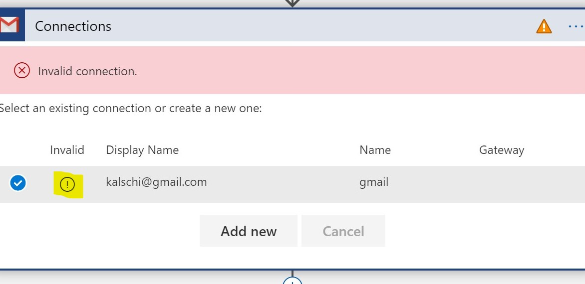
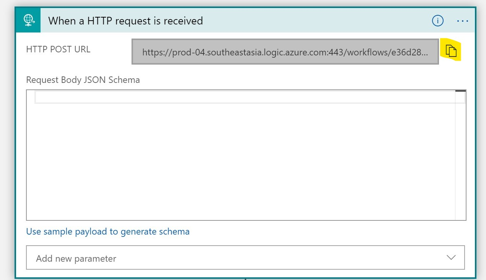

Overview
================

##  Resources
In this document, we'll have below resources created.

|Resource Type  |  Resource Name    |
|----------------|---------------------------------|
|Resource group  |michi-auto-provisioning-rg       |
|IoT Hub         | michi-hub-20190809              |
|IoT DPS         | michi-dps-20190809              |
|Azure Function  | michi-dps-azfunc-20190809       |
|Storage         | dpsmichistorage                 |
|Service Bus     | michi-iothub-events             |
|Service Bus Queue   | device-events             |
|Storage         | device-events                 |
|Logic App       | DPS-Integration-Flow

Deploy Cluod Resources
======================

####    Create Resrouce Groups

```bash
az group create -n michi-auto-provisioning-rg -l southeastasia
```

####    Create Service Bus Queue

-   Create Service Bus Queue

```bash
#   Create Service Bus Namespace
az servicebus namespace create -g  michi-auto-provisioning-rg  -l southeastasia --sku Basic -n michi-iothub-events

#   Create Service Bus Queue
az servicebus queue create --namespace-name  michi-iothub-events -g  michi-auto-provisioning-rg  -n device-events
```


####    Create IoT Hub and DPS

```bash
# Create IoT Hub
az iot hub create --name michi-hub-20190809 --resource-group michi-auto-provisioning-rg --location southeastasia --sku S1

# Create DPS
az iot dps create --name michi-dps-20190809 --resource-group michi-auto-provisioning-rg --location southeastasia

##  Note the output resource Id here
#   "id": "/subscriptions/xxx-xxx-xxx-xxx/resourceGroups/michi-auto-provisioning-rg/providers/Microsoft.Devices/provisioningServices/michi-dps-20190809",
```

-   Link IoT Hub to DPS

```bash
#   Get IoT Hub Connection String
FOR /F "tokens=*" %a in ('az iot hub show-connection-string --name michi-hub-20190809 --key primary --query connectionString -o tsv') do SET connString=%a
echo %connString%

# Link IoT Hub to DPS
az iot dps linked-hub create --dps-name michi-dps-20190809 --resource-group michi-auto-provisioning-rg --connection-string %connString% --location southeastasia

# Verify
az iot dps show --name michi-dps-20190809

# Get Policy Primary Key
az iot dps access-policy show -n provisioningserviceowner --dps-name michi-dps-20190809 -g michi-auto-provisioning-rg --query primaryKey
```

-   Create Event Subscription

We use event subscription to monitor device registration events and report back status to CRM.

```bash
# Get IoT Hub Resource Id
az iot hub show --name michi-hub-20190809 --resource-group michi-auto-provisioning-rg --query id
##  Note down Resource Id
#   "/subscriptions/xxxxxxxxx/resourceGroups/michi-auto-provisioning-rg/providers/Microsoft.Devices/IotHubs/michi-hub-20190809"

#   Get Service Bus Queue resource Id
az servicebus queue show -n  device-events --namespace-name michi-iothub-events  --resource-group michi-auto-provisioning-rg --query id
##  Note down resource id

#   Install EventGrid Azure CLI Extension
az extension add -n eventgrid

az eventgrid event-subscription create \
    --name device-registration-events \
    --source-resource-id  <IOTHUB_RESOURCE_ID>\
    --endpoint-type servicebusqueue \
    --endpoint <STORAGE_QUEUE_RESOURCE ID> \
    --included-event-types Microsoft.Devices.DeviceCreated Microsoft.Devices.DeviceDeleted

# az eventgrid event-subscription create --name device-registration-events --source-resource-id /subscriptions/e35c484f-2d35-479f-8adb-9fe20c79394e/resourceGroups/michi-auto-provisioning-rg/providers/Microsoft.Devices/IotHubs/michi-hub-20190809 --endpoint-type servicebusqueue --endpoint /subscriptions/e35c484f-2d35-479f-8adb-9fe20c79394e/resourceGroups/michi-auto-provisioning-rg/providers/Microsoft.ServiceBus/namespaces/michi-iothub-events/queues/device-events --included-event-types Microsoft.Devices.DeviceCreated Microsoft.Devices.DeviceDeleted

```

####    Deploy Azure Function

-   Create dps/src/dps_svc_api/DPS_API/DPS_CRM_API/local.settings.json

```json
{
  "IsEncrypted": false,
  "Values": {
    "FUNCTIONS_WORKER_RUNTIME": "dotnet",
    "DPS_CONNECTIONSTRING":"HostName=<DPS_HOST_NAME>;SharedAccessKeyName=provisioningserviceowner;SharedAccessKey=<POLICY KEY RETRIEVED ABOVE>"
  }
}
```

-   Create Storage Account

```bash
# Create storage account
az storage account create -n dpsmichistorage -g michi-auto-provisioning-rg --sku Standard_LRS
```

-   Create Function App and Deploy codes to Azure

```bash
##  Update Azure Funciton Core Tool
npm i -g azure-functions-core-tools --unsafe-perm true

## Create Consumption Plan Function App if not already
az functionapp create -n michi-dps-azfunc-20190809 -g michi-auto-provisioning-rg --runtime dotnet -s dpsmichistorage --consumption-plan-location southeastasia --os-type Windows

## Publish Function App to Azure
cd dps/src/dps_svc_api/DPS_API
func azure functionapp publish michi-dps-azfunc-20190809 --publish-local-settings -i 

##  Notedown invoke url
# Syncing triggers...
# Functions in michi-dps-azfunc-20190809:
#     DeviceProvisioningAPI - [httpTrigger]
#         Invoke url: https://michi-dps-azfunc-20190809.azurewebsites.net/api/DeviceProvisioningAPI?code=xxxxxxxxxxxxxxxxxxxxxxxxxxxxxxxxxxxxxx==
```

##  Logic App

We use Logic App to orchestrate provisioning flow including send email to end users. Here we create a GMAIL API connection for Logic App to send email.

- Update dps/src/logic-app/logicapp.parameters.json

```json
{
    "$schema": "https://schema.management.azure.com/schemas/2015-01-01/deploymentParameters.json#",
    "contentVersion": "1.0.0.0",
    "parameters": {
        "workflows_DPS_Integration_Flow_name": {
            "value": "DPS-Integration-Flow"
        },
        "DPS_API_URL":{
            "value":"<Azure Function URL>"
        }
    }
}
```

- Deploy Gmail API Connection

```bash
az group deployment create -n LogicAppConnection -g michi-auto-provisioning-rg --template-file gmail-api-connection.json --parameters @gmail-api-connection.parameters.json

```

- Deploy Logic App

```bash
az group deployment create -n LogicAppFlow -g michi-auto-provisioning-rg --template-file logicapp.json --parameters logicapp.parameters.json

```

- Once deployed, login to Azure Portal. Open Logic App Designer to Authenticate the connection.



- Also, note down the Logic App HTTP endpoint URL




Setup device codes
==================

##  Device Portal


User should input device keys and required information via Device Portal, those information will be saved on device.

In our scenario, two files will be created.

| File  |  Comment     |
|----------------|---------------------------------|
| dps/conn.txt| Stores device connection string to IoT Hub |
| APP_DATA/device_provision_list.json | stores device provision records.|

- Create /dps/src/device_portal/web/appsettings.json. Add DPS_Scope and DPS_GlobalEndpoint value

```json
{
  "DPS_Scope": "xxxx",
  "DPS_GlobalEndpoint": "global.azure-devices-provisioning.net"
}
```
##  Device

- Device will read connection information (conn.txt) input by users via Device Portal. There is no configure steps to setup device. Just do dotnet run to execute it once conn.txt is created.

```bash
dotnet run
```


Mock CRM
========

A Mock CRM is created to demonstrate this scenario. It calls to DPS API Layer to register a enrollment.

- Create crm/src/web/web/appsettings.json with API URL we deployed earlier.

```json
{
  "Logging": {
    "LogLevel": {
      "Default": "Warning"
    }
  },
  "AllowedHosts": "*",
  "API_URL":"<Logic App API URL>"
}
```

- Run CRM locally

```bash
cd crm/src/web/web/
dotnet run
```
