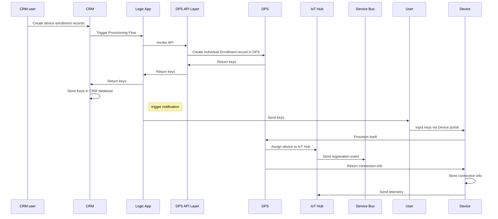

```mermaid
sequenceDiagram
    participant CRM user
    participant CRM
    participant Logic App
    participant DPS API Layer
    participant DPS
    participant IoT Hub
    participant Service Bus

    participant User
    participant Device

    CRM user->>CRM: Create device enrollment records
    CRM ->> Logic App: Trigger Provisioning Flow
    Logic App ->> DPS API Layer: Invoke API
    DPS API Layer ->> DPS: Create Individual Enrollment record in DPS
    DPS ->> DPS API Layer: Return keys
    DPS API Layer ->> Logic App: Return keys
    Logic App ->> CRM: Return keys
    CRM ->> CRM: Store Keys in CRM database
    Note right of Logic App: trigger notification
    Logic App ->> User: Send keys
    
    User ->> Device: Input keys via Device portal
    Device ->> DPS: Provision itself
    DPS ->> IoT Hub: Assign device to IoT Hub
    IoT Hub ->> Service Bus: Send registration event
    DPS ->> Device: Return connection info
    Device ->> Device: Store connection info
    Device ->> IoT Hub: Send telemetry
```
