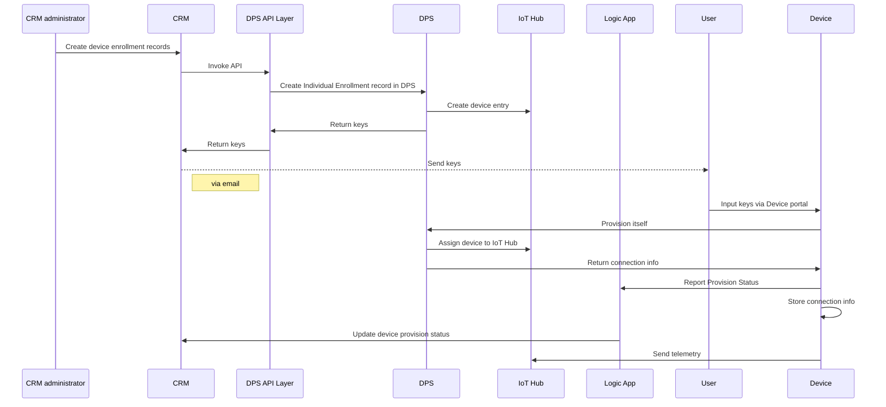

```mermaid
sequenceDiagram
    participant CRM administrator
    participant CRM
    participant DPS API Layer
    participant DPS
    participant IoT Hub
    participant Logic App
    participant User
    participant Device
    
    CRM administrator->>CRM: Create device enrollment records
    CRM ->> DPS API Layer: Invoke API
    DPS API Layer ->> DPS: Create Individual Enrollment record in DPS
    DPS ->> IoT Hub: Create device entry
    DPS ->> DPS API Layer: Return keys
    DPS API Layer ->> CRM: Return keys
    CRM -->> User: Send keys
    Note right of CRM: via email
    
    User ->> Device: Input keys via Device portal
    Device ->> DPS: Provision itself
    DPS ->> IoT Hub: Assign device to IoT Hub
    DPS ->> Device: Return connection info
    Device ->> Logic App: Report Provision Status
    Device ->> Device: Store connection info
    Logic App ->> CRM: Update device provision status
    Device ->> IoT Hub: Send telemetry
```
