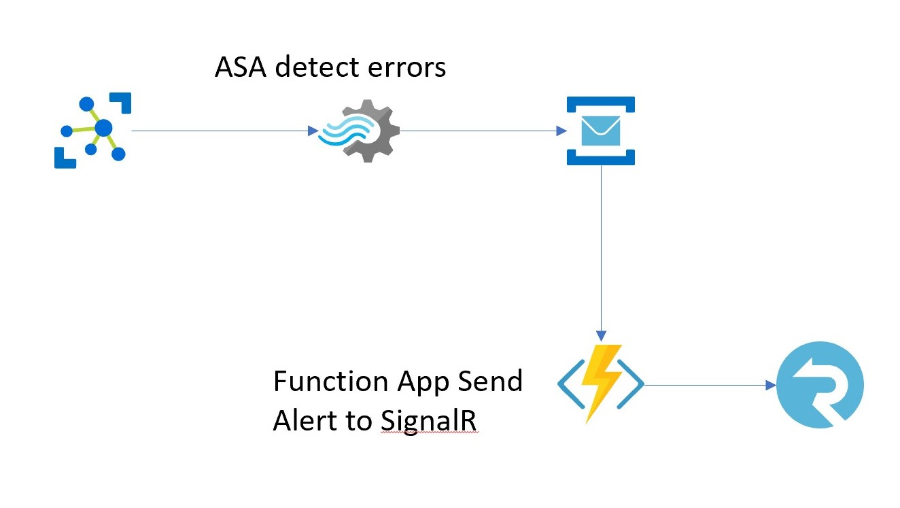
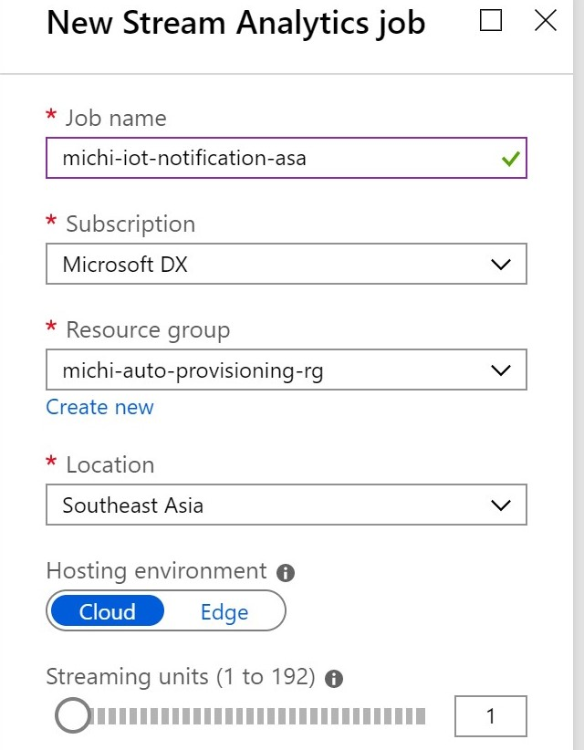

## Overview

It is a common scenario that your operator or IT administrator may want to get notifications when IoT devices are sending alerts to your backend solution.

We have created a sample IoT solution, now we want to add alert mechanism to existing solution. To decouple notification mechanism with IoT solution, we will be creating a Stream Analytics Job to detect if there is any issues, send those events of error to a Service Bus Topic.

An Azure Functions App will then pick up these messages and broadcast to IT operators via SignalR service.



## Setup

[Service Bus Topic](#service-bus-topic)

[Stream Analytics Job](#stream-analytics)

[SignalR Service & Application backend](#signalr-service--application-backend)

[Azure Functions](#azure-functions)

#### Service Bus Topic

We will create Service Bus Topic to receive notificaiton events. Backend consumers will subscribe to this topic to get violation notifications.

-   Create a ServiceBus namespace if not already

We should reuse previously created michi-iothub-events Service Bus namespace, if not yet created, use below command to create a new one.

```bash
# In this sample we use Basic tier
az servicebus namespace create -n michi-iothub-events -g michi-auto-provisioning-rg -l southeastasia --sku Standard
```

-   If you already have Service Bus namespace created previously, make sure it is in Standard tier, or run below command to update SKU

```bash
az servicebus namespace update --sku Standard -n michi-iothub-events -g michi-auto-provisioning-rg
```

-   Create a Topic

```bash
az servicebus topic create -n iot-violation-events --namespace-name michi-iothub-events -g michi-auto-provisioning-rg --status Active
```

-   Create a subscription

```bash
az servicebus topic subscription create -n signalrsubscription --namespace-name michi-iothub-events -g michi-auto-provisioning-rg --topic-name iot-violation-events  
```

#### Stream Analytics

Stream Analytics Job will check events coming from device, find violation events and send those violation events to Service Bus Topic we created above for further processing.

-   Create a new Stream Analytics from Portal



-   Create an Input (named 'iothub') points to IoT Hub and an output (named 'notifications')points to the Service Bus Topic we created above

-   Create Query

Device simulator will keep sending temperature data to IoT Hub, we will find events has duration of high temperature (temperature >= 50) over 5 seconds


```sql
WITH SelectPreviousEvent AS
(
    SELECT
        [time],
        [temperature],
        iothub.IoTHub.ConnectionDeviceId as DeviceId,
        LAG([time]) OVER (LIMIT DURATION(hour, 24)) as previousTime,
        LAG([temperature]) OVER (LIMIT DURATION(hour, 24)) as previousTemperature
    FROM iothub TIMESTAMP BY [time]
)
SELECT
    DeviceId,
    LAG([time]) OVER (LIMIT DURATION(hour, 24) WHEN previousTemperature < 50) as FAULT_START,
    previousTime as FAULT_END,
    DATEDIFF(second, 
        LAG([time]) OVER (LIMIT DURATION(hour, 24) WHEN previousTemperature < 50),
        previousTime) as fault_duration
into notifications
FROM SelectPreviousEvent
WHERE
    ([temperature] < 50
    AND previousTemperature >= 50)
    AND DATEDIFF(second, 
        LAG([time]) OVER (LIMIT DURATION(hour, 24) WHEN previousTemperature < 50),
        previousTime) >= 5
```

-   Start the job

#### SignalR Service & Application backend

-   Create SignalR Service

```bash
 az signalr create -n michi-signalr-20190824 -g michi-auto-provisioning-rg --sku Free_F1 -l southeastasia
 ```

-   Get SignalR Connection String

```bash
 az signalr key list -n michi-signalr-20190824 -g michi-auto-provisioning-rg
 ```

-   Update /notifications/hub/appsettings.json with SignalR connection string retrieved above

```json
{
  "Logging": {
    "LogLevel": {
      "Default": "Warning"
    }
  },
  "AllowedHosts": "*",
  "SignalRService":"<SIGNALR_CONNECTIONSTRING>;"
}
```
-   By default, the sample SignalR client app connects to https://localhost:5001/deviceEvents. Change to your SignalR app URL by editing /notifications/hub/wwwroot/index.html

```javascript
var connection = new signalR.HubConnectionBuilder()
                            .withUrl('<UPDATE YOUR URL HERE>')
                            .build();
```

#### Azure Functions

-   Create a new Azure Function project

```bash
func function new -l C# -n iot-notification-handler
#   Than choose ServiceBusTopic Trigger
```

-   Clone codes and make changes to /notification/azfunc/local.settings.json

```json
{
    "IsEncrypted": false,
    "Values": {
        "AzureWebJobsStorage": "<STORAGE_ACCOUNT_CONNECTION_STRING>",
        "FUNCTIONS_WORKER_RUNTIME": "dotnet",
        "ServiceBusConnection":"<SERVICE_BUS_CONNECTION_STRING>",
        "AzureSignalRConnectionString":"<SIGNARLR_CONNECTION_STRING>"
    }
}
```

-   Change Service Bus Topic names and connection in codes when required

```csharp
public static void Run([ServiceBusTrigger("<SB_NAMESPANCE_NAME>", 
                                        "<SUBSCRIPTION_NAME>", 
                                        Connection = "<CONNECTION_STRING_NAME_IN_LocalSettings.JSON>")]
                                        string mySbMsg, ILogger log,
                                        [SignalR(HubName = "deviceEvents")]IAsyncCollector<SignalRMessage> signalRMessages)
                                        {/*...*/}
```

## SignalR Reference

[Build real-time App with Functions and SignalR Service](https://docs.microsoft.com/en-us/azure/azure-signalr/signalr-concept-azure-functions)

[Azure SignalR Service authentication with Azure Functions](https://docs.microsoft.com/en-us/azure/azure-signalr/signalr-tutorial-authenticate-azure-functions)

[SignalR quick start](https://docs.microsoft.com/zh-tw/azure/azure-signalr/signalr-quickstart-dotnet-core)