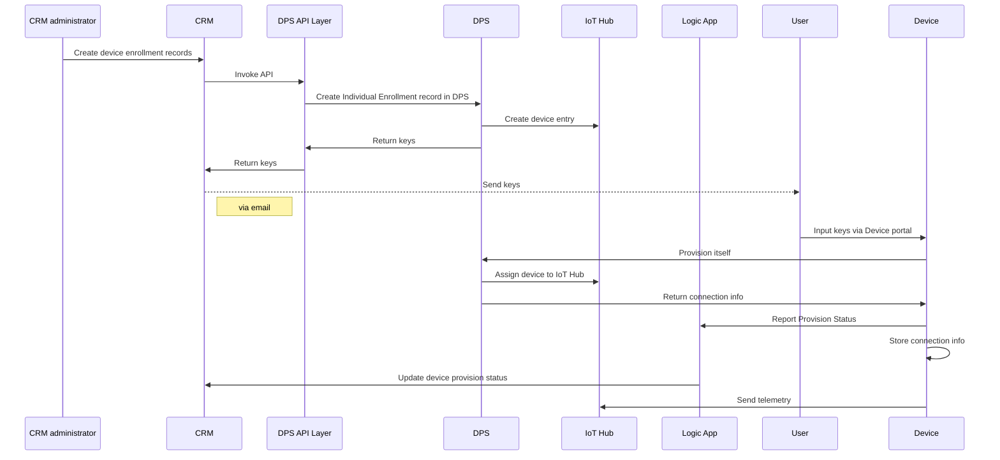

## Device Provisioning Flow

This sample demonstrate how to automate device provisioning process.

(Can't see below diagram ? [Provision Flow](docs/img/provisioning-flow.jpg))



## How to run this application

#### Backend application

-   Download source codes

-   [Setup Device Provisioning Service](docs/dps.md) to create DPS and link IoT Hub to it.

-   [Setup Device Provisioning Service Middleware API](docs/dps_api.md) for backend applications to communicate with DPS.

-   Create crm/src/web/web/appsettings.json file with below content.

```json
{
  "Logging": {
    "LogLevel": {
      "Default": "Warning"
    }
  },
  "AllowedHosts": "*",
  "DPS_Scope": "<Your DPS ID_SCOPE>",
  "DPS_GlobalEndpoint": "global.azure-devices-provisioning.net",
  "API_URL": "<YOUR Device Provisioning Service Middleware API URL>"
}
```

-   To run mock CRM web portal

```bash
cd crm/src/web/web
dotnet run
```

#### Device Setup

-   If you are using Raspberry Pi, see [Setup Raspberry Pi](docs/raspberry-pi.md)

-   Create src/device_portal/web/appsettings.json with below content

```json
{
  "Logging": {
    "LogLevel": {
      "Default": "Warning"
    }
  },
  "AllowedHosts": "*",
  "DPS_Scope": "<DPS ID_SCOPE>",
  "DPS_GlobalEndpoint": "global.azure-devices-provisioning.net"
}
```

-   Run device poral

```bash
cd dps/src/device_portal/web
dotnet run
```

-   Update dps/src/data/random_telemetry.json

```json
{"data":"sample 1"}
{"data":"sample 2"}
{"data":"sample 3"}
```
-   Run device

```bash
cd dps/src/symmetric-key-individual-2steps
dotnet run
```