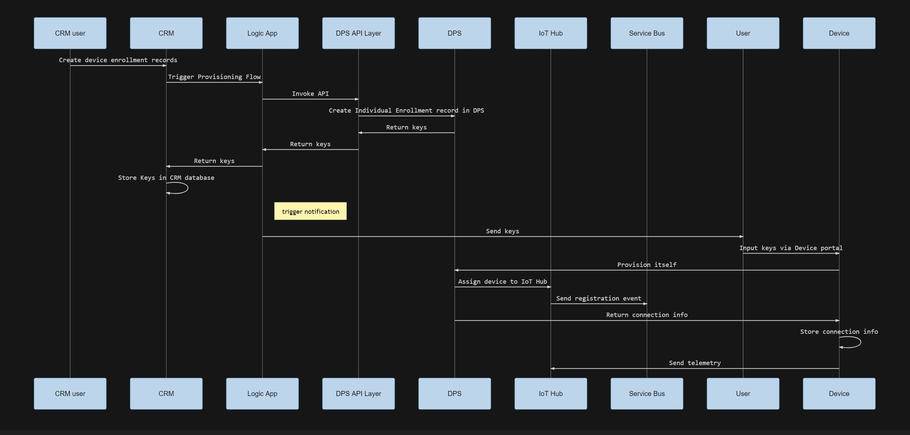

## Device Provisioning Flow Overview

In this demo, there are following participants involved in device provisioning process.

- CRM administrator
  
  Who is in charge of managing devices from asset perspective. When a device is delivered to the solution provider by manufacturer, he inputs device information to the solution provider's backend system. And record to which customer this device is sold to.

- End user

  When end user receives a device, a key information will be sent to the user from solution provider. The end user needs to register his device to the cloud.

In order to better architect this solution, we devided this solution into several parts

- Azure Device Provisioning Service

  Azure DPS manages device registration records, authenticate device with attestation mechanism of choice, assign a device to proper IoT Hub based on allocation policy configured in the cloud.

  Device Provisioning Service provides different provisioning mechanism, for simplicity, we are using Individual enrollment with symmetric key attestation.
   
- Azure IoT Hub

  Azure IoT Hub is the front line service which has direct connection to devices. A device will be sending telemetry to its associated IoT Hub.
  
  IoT Hub can also issue cloud-to-device commands, or request devices to update themselves by updating Desired Properties.

- DPS API Middleware

  Instead of having backend solution talk to DPS directly, an DPS API middle tier is created to decouple DPS and backend cunsumers. The API layer should maintain a list of device registration records as well as mapping between device and IoT Hub, so that its backend consumer can query through each device when required.

- Device

  A Device portal is installed in the device, when user receives provision key from solution provider. He needs to connect to this portal and input provided information to provision his device.

  Note:

  >In this sample, we seperate device portal and device telemetry sender programs since generally speaking, provisioning and sending telemetry are different process.

- Logic App

  Finally, a Logic App is created to accept device provisioning status report. Note that this can be done by updating device's reported property. With Logic App it is easier to integrate with other backend systems. 

  Note that in this sample, we do not include Logic App (yet).

- Full Device provisioning process is illustrated below.

##  Deploy

Follow this [instruction](docs/deploy.md) to deploy resourcecs.

## How to run this application

Follow this [instruction](docs/run.md) to run this application.
